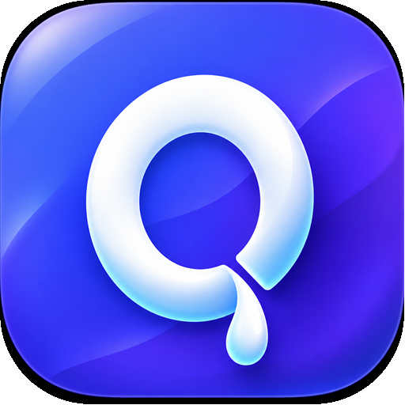

<p align="center">
  
</p>

# QuickDrop Go SDK

[English](#english) | [简体中文](#简体中文)

<a id="english"></a>

## English

Public Go packages for building native QuickDrop clients. The SDK contains no
HTTP server, Redis, SQL, account database, or deployment code.

- `api` — typed QuickDrop HTTP client and shared API models.
- `signaling` — peer signaling WebSocket.
- `presence` — logged-in device discovery and no-code pairing.
- `webrtc` — direct-first WebRTC peer connection with optional TURN fallback.
- `transfer` — bounded, resumable, SHA-256 verified file and text transfer.
- `protocol` — language-neutral DataChannel framing and control messages.

The `webrtc` directory intentionally exports package `peer`, so callers read
naturally and do not confuse it with Pion's `webrtc` package:

```go
client, err := api.New("https://drop.example.com", token)
connection := peer.New(client, credentials, true, peer.PeerOptions{})
result, err := connection.Connect(ctx)
manager := transfer.NewTransferManager(result.Transport, result.MaxMessageSize, transfer.TransferOptions{})
```

Run `go test ./...` and `go vet ./...` before publishing. Protocol compatibility
is defined in [`docs/protocol-v1.md`](docs/protocol-v1.md); repository release
compatibility is tracked in [`docs/compatibility.md`](docs/compatibility.md).

## Module path

The canonical module path is `github.com/Aruelius/quickdrop-go`. Keep this path
and all imports unchanged after publishing the first tag so downstream modules
continue to resolve the SDK correctly.

<a id="简体中文"></a>

## 简体中文

这是用于构建 QuickDrop 原生客户端的公共 Go SDK，不包含 HTTP 服务端、Redis、SQL、账号数据库或部署代码。

- `api` — 带类型的 QuickDrop HTTP 客户端和共享 API 模型。
- `signaling` — 点对点信令 WebSocket。
- `presence` — 登录后的设备发现和免连接码配对。
- `webrtc` — 直连优先、可选 TURN 降级的 WebRTC 连接。
- `transfer` — 有内存边界、可续传、使用 SHA-256 校验的文字和文件传输。
- `protocol` — 与编程语言无关的 DataChannel 帧和控制消息。

`webrtc` 目录有意导出名为 `peer` 的包，使调用代码语义更自然，也避免与 Pion 的 `webrtc` 包混淆：

```go
client, err := api.New("https://drop.example.com", token)
connection := peer.New(client, credentials, true, peer.PeerOptions{})
result, err := connection.Connect(ctx)
manager := transfer.NewTransferManager(result.Transport, result.MaxMessageSize, transfer.TransferOptions{})
```

发布前运行 `go test ./...` 和 `go vet ./...`。协议兼容规则见 [`docs/protocol-v1.md`](docs/protocol-v1.md)，仓库版本兼容关系见 [`docs/compatibility.md`](docs/compatibility.md)。

### 模块路径

正式模块路径为 `github.com/Aruelius/quickdrop-go`。首次发布标签后应保持该模块路径及全部 import 不变，确保下游项目可以持续正确解析 SDK。

### 许可证

本项目采用 [Apache License 2.0](LICENSE) 开源。
